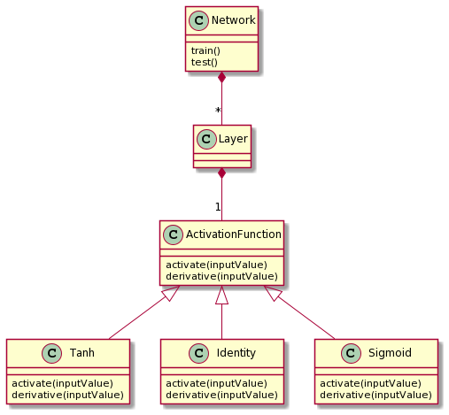
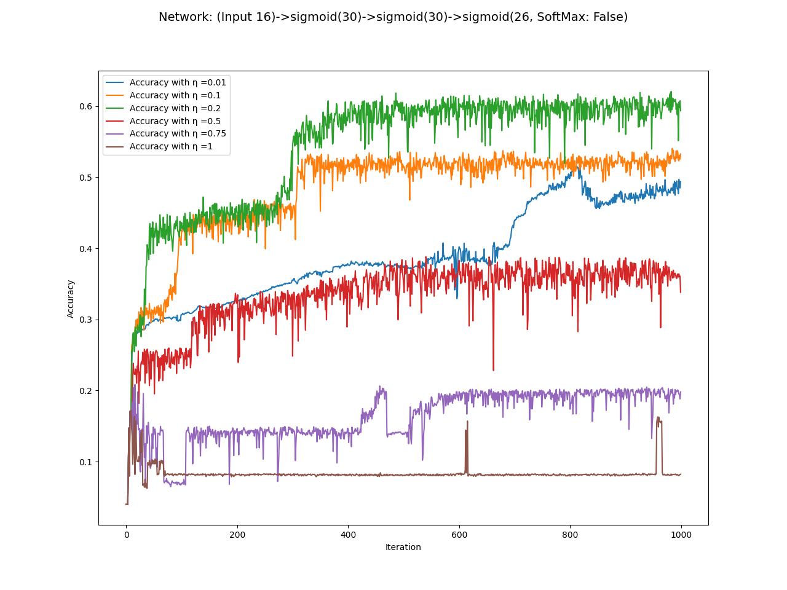
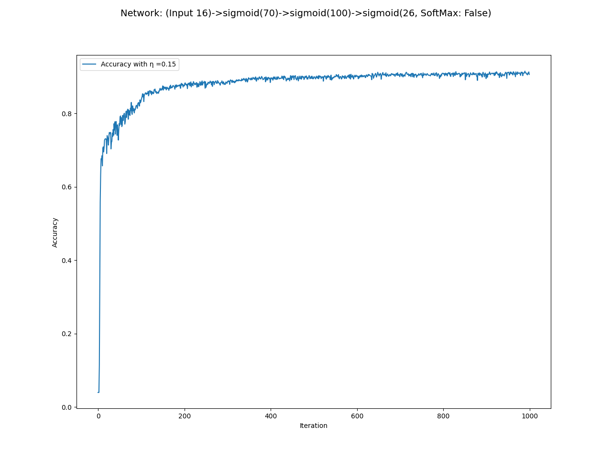

# Multi Layer Perceptron

Multi-Layer Perceptron (MLP) Neural Network implemented from scratch with **Python** and **NumPy**. Implemented feed-forward and backpropagation to be able to train using numeric input

## Usage

All of the code that handles the instances of the problems and plotting the results is present in *main.py*, to run it we can use:

```Usage: python3 main.py [--debug] [xor/sin/letters (plot)]```

Thus, when executing we can use the optional *--debug* option to see all of the internal operations of the network (there's a lot of information with this, I don't recommend using it. Its purpose was only to debug when I had problems early on).

Furthermore, we can then specify which of the [examples](#examples) we want to execute: **xor**, **sin** or **letters** for letter recognition.

Lastly, we have a "**plot**" tag that can be used to indicate that we want to execute the training for multiple learning rates and plot the results (and save them in a file at the **results/** folder).

If "plot" is not specified, the program will by default run the network with the learning rate specified in the code (we can change it and modify other parameters too, like the number of epochs/iterations). All plots have in their title the definition of the model: *input size* and then *activation* and *size* for each of the layers.

## Model

The structure is as follows:

* **Network**: A list of layers (in *Network.py*)
* **Layer**: A list of neurons with an activation function (in *Layer.py*)
* **ActivationFunction**: Parent class of multiple activationo functions (in *Neuron.py*)

At first I also used a "Neuron" class, but I found it much easier to simply apply the ActivationFunction to the whole output vector of the layer (code and computation-wise)

This is a simple class diagram to get an idea of the model (without most methods):




This is an example of the code that is needed to create, train, and test a Network:

```
hiddenLayer = Layer.Layer(2, 4)
outputLayer = Layer.Layer(4, 1, activation=Neuron.Tanh())
network = Network.Network([hiddenLayer, outputLayer], learningRate=1)
network.train(trainData, trainTarget)
network.test(testData, testTarget)
```

To initialize a Network first we create some layers, indicating the **input size**, **layer size** and the **activation function** if desired (if no activation function is specified when creating the layer, the logistic sigmoid function is used by default).

The order of the layers in the list given to the networks is the order in the latter, which performs checks for the consistency of the given network (the size of a layer and the input size of the next layer should be the same). Therefore, the input size of our first hidden layer should be the same size as each of our training examples. Each layer will also have 1 bias and therefore 1 weight for each of the layer's neurons.

Each of the activation functions implement, given an input, the function itself and their derivative, this way when doing back-propagation we can simply call the derivative method of the given activation function to get the result without having the derivative function hard-coded.

Regarding back-propagation, at first I implemented it in an iterative way to be able to fully understand the algorithm, but this was obviously very slow because all was done in Python and NumPy wasn't carrying much of the load, finally I implemented it with matrix multiplications too and both methods are still present in the code (computeWeights() and computeWeightsIterative())

One epoch of training with 1/5 of the letters data-set now takes around 1 second, whilst before it took around 4-5 minutes, so I was able to test different parameter configurations and compare.

## Examples

The main code contains three training examples in order of increasing complexity to test the MLP

### XOR

This first example simply models the XOR logical door (which is not linearly separable) to test the network.

In this case we only have 4 "examples" and we use them both for training and testing. For this problem the network has an input of 2 and an ouput of 1 to be able to model the logical door. 

This is an example of the result of the network after 1000 epochs, as we can see the results are close to what we want.

| x      | y | $\oplus$ | Network |
| ----------- | ----------- | ----------- | ----------- |
0 | 0 | 0 | 0.013 |
0 | 1 | 1 | 0.986 |
1 | 0 | 1 | 0.981 |
1 | 1 | 0 | 0.023 |

### Sinus

Another simple example is modeling the Sinus function, with the input being 4 random uniformly generated numbers $x_1...x_4$, and the output being a combination of them: $sin(x_1 - x_2 + x_3 - x_4)$ (although it could be any other combination, it's just to have 4 different numbers as the input).

These are just 4 examples of the output of the trained network, after training it with 400 different examples (that is, the sinus of 4 random numbers 400 times) and tested with 100 more:

Real value | Network output |
|-----------|-----------|
0.68430488 | 0.68443658 |
0.30738451 | 0.30752381 |
... | ... |
-0.98706745 | -0.98665011 |
-0.44005262 | -0.43961368 |

### Letter recognition

Finally, we have a more challenging case using the [UCI dataset](http://archive.ics.uci.edu/ml/datasets/Letter+Recognition) with numeric features describing each of the training examples, which are handwritten digits.

In this case I tested the performance based on the accuracy, using 4/5 of the dataset for training and 1/5 for testing. For the modeling I stored the numerical features as the input vector and I transformed the letter label into a vector of 26 zero elements with only one 1 in index $i$, representing the letter $i$ out of 26 (the index out of 26 is computed as the integer codification of the given character - 65, the codification for A, the first one). This vector is the target output of the problem ($y$) with the letter label as the target ($y'$).

We can also convert this back to the character and the same goes for the output of the last layer of our network (with 26 units) which hopefully should have the higher activation value for the character index it is predicting. So we obtain the prediction by getting the index out of 26 with the higher activation.

Here are some tests I did with different learning rates to see which one performed better:



We can see that $\eta=0.1$ is the most stable one in general, although its performance also decreases a bit towards the end, and its convergence is still slow. Regarding the high learning rate values like 0.75 or 1, for this problem, we can see that the performance is the worst among the tested values, they have too much variation and they are probably constantly overshooting the minimum and staying in a similar place, this is more evident for the case of $\eta=1$ in which it practically becomes stagnant at an early point (and there's a couple of spikes but goes back to a very poor accuracy).

One of the best configurations that I tested was the following (with the network information at the top), using a learning rate of 0.15:



This one consistently stayed between 0.89-0.91 accuracy for the training set. The key here besides having a large number of neurons as before, was to decrease the learning rate from 0.15 to 0.1 past 100 iterations as we are getting closer to the minima: to not overshoot it even if we have a slower convergence.

Finally, here are some results to see how well it performs on the test set:

Iterations | Train Accuracy | Test Accuracy | Train Loss | Test Loss  |
|-----------|-----------|----------|-----------|-----------|
300 | 0.92945 | 0.89428 | 0.05059 | 0.07697 |
1000 | 0.95057 | 0.90668 | 0.03550 | 0.07273 |
2000 | 0.96815 | 0.91502 | 0.01686 | 0.06723 |

We can clearly see that performance of the network is slightly better on the train data, which makes sense as it is the data that is being fitted, but it seems to not loose a lot of accuracy with unseen data. Judging by the numbers in the table it seems like it's staring to overfit, as there is not a lot of variation from 300 to 2000 iterations in the test accuracy (from 0.89 to 0.91) but the train accuracy goes up from 0.92 to 0.96, fitting better and better the train data. Perhaps it would be better to use only 300 iterations in this case to perform better with other unseen cases, but it seems to be generalizing considerably well if we look at the test accuracy and I'm very satisfied with the results.

## Authors

* [mbdavid2](https://github.com/mbdavid2)
